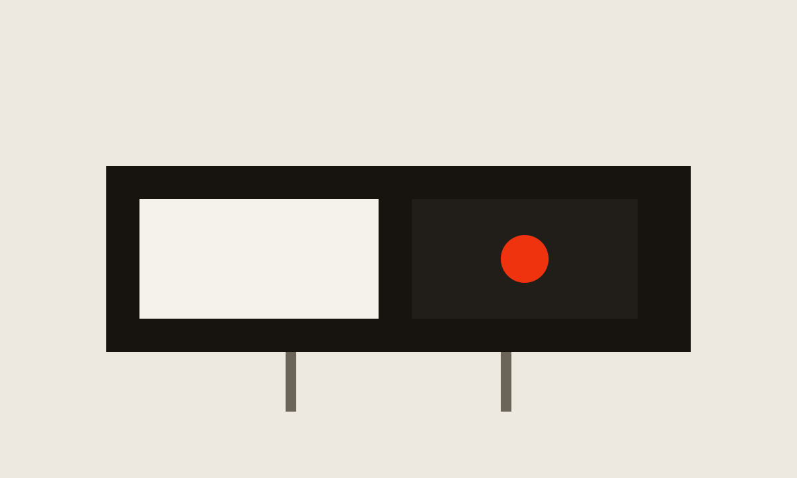

i wanted a place to write about things i find interesting, or whatever is sitting on my mind. nothing formal. just notes.

a new note is a folder. the writing goes in `index.md`, and any pictures sit in that same folder. the cover at the top of the file is what shows up in the list.
